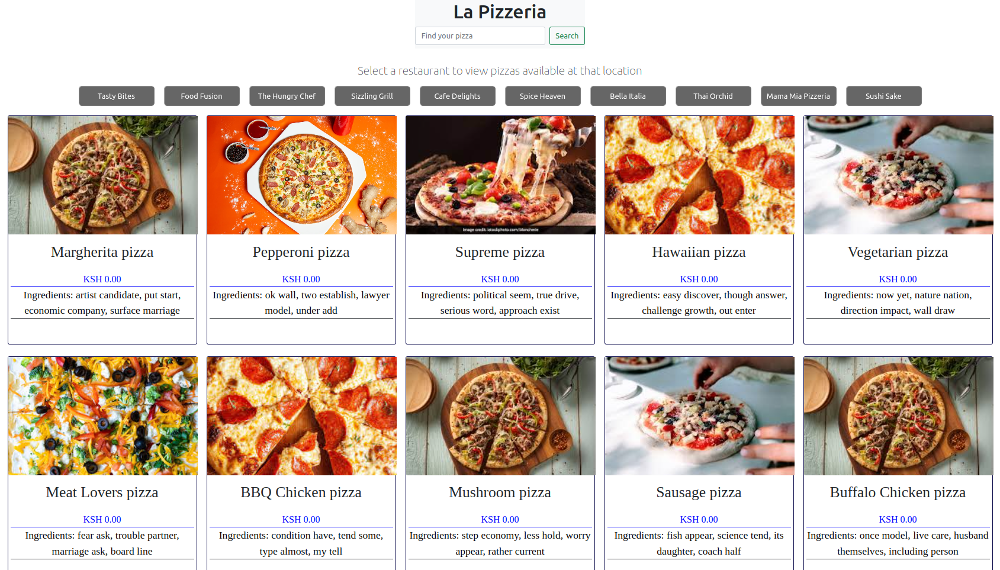

# THE PIZZERIA

### Flask Code Challenge - Pizza Restaurants

This is a project creating a FLASK API for a Pizza Restaurant domain.

Running the Flask server and using Postman to make requests
Models. You need to create the following relationships:

- A Restaurant has many Pizzas through RestaurantPizza
- A Pizza has many Restaurants through RestaurantPizza
- A RestaurantPizza belongs to a Restaurant and belongs to a Pizza

### Validations

Add validations to the RestaurantPizza model:

- Must have a price between 1 and 30

Add validations to Restaurant Model:

- must have a name less than 50 words in length
- must have a unique name

### Routes

- Set up the following routes. Make sure to return JSON data in the format specified along with the appropriate HTTP verb.
- GET /restaurantsLinks to an external site.
- Return JSON data in the format below:

# SET UP & CONFIGURATION

## VIRTUAL ENVIRONMENT

1. Create virtual environment
   - `mkdir flask-python-the-pizzeria`
   - `cd flask-python-the-pizzeria`
   - `pip install pipenv`
   - `pipenv install Flask`

## CREATE $ CONFIGURE FLASK APP

1. In app.py.
2. from flask import Flask
3. app = Flask(**name**)
4. app.config["SQLALCHEMY_DATABASE_URI"] = 'sqlite:///app.db'
5. app.config['SQLALCHEMY_TRACK_MODIFICATIONS'] = False
6. app.json.compact = False
7. import app to routes module to instantiate app and use it
8. link db form models to to app
9. e.t.c

## CREATE FLASK DB

1. Run:
   - `pipenv install flask-migrate `
2. In `app.py`.
   - from flask_migrate import Migrate
   - migrate = Migrate(app, db)
   - db.init_app(app)
3. Run to create database:
   - `export FLASK_APP=app.py`
   - `export FLASK_RUN_PORT=5555`
   - `flask db init `
   - `flask db migrate -m "Initial migration"`
   - `flask db upgrade`
4. Update db with tables:
   - `flask db revision --autogenerate -m'Create tables owners, pets'`
